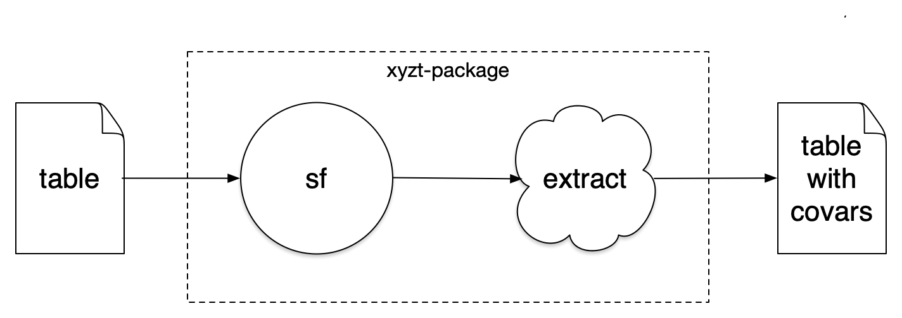

xyzt
================

Mediate covariate extraction using tabular location data. This package
will make the transform from tabular data to standardized
[sf](https://CRAN.R-project.org/package=sf) objects easier. We use
[sf](https://CRAN.R-project.org/package=sf) objects to harmonize
subsequent data extractions.



The extraction step is not defined in this package, although we provide
a uniform interface for selection of an external application to run the
extraction. For example, suppose you have an application that accepts an
`sf POINT` object and returns a table of ‘sst’ from ‘MUR’ using your own
`murtools` package. That packe must have a function that accepts any
[sf](https://CRAN.R-project.org/package=sf) object (POINT, POLYGON) and
will return a table of covariates append-able to you own data set.

    dataset <- [some table of data with location and time]
    x <-  dataset |>
      as_POINT() 
      
    covars <- x |>
      extract(package = "murtools", var = "analysed_sst", "mask")
      
    result <- dplyr::bind_cols(dataset, covars)

### Requirements

-   [R v4.1+](https://www.r-project.org/)
-   [rlang](https://CRAN.R-project.org/package=rlang)
-   [assertthat](https://CRAN.R-project.org/package=httr)
-   [dplyr](https://CRAN.R-project.org/package=httr)
-   [sf](https://CRAN.R-project.org/package=sf)
-   [readr](https://CRAN.R-project.org/package=readr)

### Installation

    remotes::install_github("BigelowLab/xyzt")

## Usage

All transactions hinge around tables (data frames) of data or
[sf](https://CRAN.R-project.org/package=sf) objects. If a table (we
suggest [tibble](https://CRAN.R-project.org/package=tibble)) then
minimal metadata is required to establish a coordinate reference system.

### Input tables

We provide an example data set of points from the Gulf of Maine.

``` r
suppressPackageStartupMessages({
  library(dplyr)
  library(xyzt)
  library(sf)
})
(x <- read_gom())
```

    ## # A tibble: 5 × 6
    ##   id    name             lon   lat depth time               
    ##   <chr> <chr>          <dbl> <dbl> <dbl> <dttm>             
    ## 1 44098 Jeffreys Ledge -70.2  42.8     0 2022-06-23 18:42:08
    ## 2 44005 Cashes Ledge   -69.2  43.2     0 2022-04-15 10:43:10
    ## 3 44037 Jordan Basin   -67.9  43.5     0 2022-06-13 10:32:12
    ## 4 44011 Georges Bank   -66.6  41.1     0 2022-06-13 03:23:45
    ## 5 44008 Nantucket SE   -69.2  40.5     0 2022-06-07 23:45:56

### Convert to [sf](https://CRAN.R-project.org/package=sf)

Here we show conversion to 2d (‘xy’), 3d (‘xyz’ or ‘xyt’) or 4d (‘xyzt’)
type spatial POINT objects. Note that time coordinates are shown as
numeric (number of seconds since 1970-01-01 epoch).

``` r
(xy <- as_POINT(x, crs = 4326, dims = "xy"))
```

    ## Simple feature collection with 5 features and 4 fields
    ## Geometry type: POINT
    ## Dimension:     XY
    ## Bounding box:  xmin: -70.17 ymin: 40.5 xmax: -66.59 ymax: 43.5
    ## Geodetic CRS:  WGS 84
    ## # A tibble: 5 × 5
    ##   id    name           depth time                      geometry
    ## * <chr> <chr>          <dbl> <dttm>                 <POINT [°]>
    ## 1 44098 Jeffreys Ledge     0 2022-06-23 18:42:08 (-70.17 42.81)
    ## 2 44005 Cashes Ledge       0 2022-04-15 10:43:10 (-69.22 43.17)
    ## 3 44037 Jordan Basin       0 2022-06-13 10:32:12  (-67.87 43.5)
    ## 4 44011 Georges Bank       0 2022-06-13 03:23:45 (-66.59 41.09)
    ## 5 44008 Nantucket SE       0 2022-06-07 23:45:56  (-69.24 40.5)

``` r
(xyz <- as_POINT(x, crs = 4326, dims = "xyz"))
```

    ## Simple feature collection with 5 features and 3 fields
    ## Geometry type: POINT
    ## Dimension:     XYZ
    ## Bounding box:  xmin: -70.17 ymin: 40.5 xmax: -66.59 ymax: 43.5
    ## Geodetic CRS:  WGS 84
    ## # A tibble: 5 × 4
    ##   id    name           time                          geometry
    ## * <chr> <chr>          <dttm>                     <POINT [°]>
    ## 1 44098 Jeffreys Ledge 2022-06-23 18:42:08 Z (-70.17 42.81 0)
    ## 2 44005 Cashes Ledge   2022-04-15 10:43:10 Z (-69.22 43.17 0)
    ## 3 44037 Jordan Basin   2022-06-13 10:32:12  Z (-67.87 43.5 0)
    ## 4 44011 Georges Bank   2022-06-13 03:23:45 Z (-66.59 41.09 0)
    ## 5 44008 Nantucket SE   2022-06-07 23:45:56  Z (-69.24 40.5 0)

``` r
(xyt <- as_POINT(x, crs = 4326, dims = "xyt"))
```

    ## Simple feature collection with 5 features and 3 fields
    ## Geometry type: POINT
    ## Dimension:     XYM
    ## Bounding box:  xmin: -70.17 ymin: 40.5 xmax: -66.59 ymax: 43.5
    ## Geodetic CRS:  WGS 84
    ## # A tibble: 5 × 4
    ##   id    name           depth                    geometry
    ## * <chr> <chr>          <dbl>                 <POINT [°]>
    ## 1 44098 Jeffreys Ledge     0 M (-70.17 42.81 1656009728)
    ## 2 44005 Cashes Ledge       0 M (-69.22 43.17 1650019390)
    ## 3 44037 Jordan Basin       0  M (-67.87 43.5 1655116332)
    ## 4 44011 Georges Bank       0 M (-66.59 41.09 1655090625)
    ## 5 44008 Nantucket SE       0  M (-69.24 40.5 1654645556)

``` r
(xyzt <- as_POINT(x, crs = 4326, dims = "xyzt"))
```

    ## Simple feature collection with 5 features and 2 fields
    ## Geometry type: POINT
    ## Dimension:     XYZM
    ## Bounding box:  xmin: -70.17 ymin: 40.5 xmax: -66.59 ymax: 43.5
    ## Geodetic CRS:  WGS 84
    ## # A tibble: 5 × 3
    ##   id    name                                 geometry
    ## * <chr> <chr>                             <POINT [°]>
    ## 1 44098 Jeffreys Ledge ZM (-70.17 42.81 0 1656009728)
    ## 2 44005 Cashes Ledge   ZM (-69.22 43.17 0 1650019390)
    ## 3 44037 Jordan Basin    ZM (-67.87 43.5 0 1655116332)
    ## 4 44011 Georges Bank   ZM (-66.59 41.09 0 1655090625)
    ## 5 44008 Nantucket SE    ZM (-69.24 40.5 0 1654645556)
